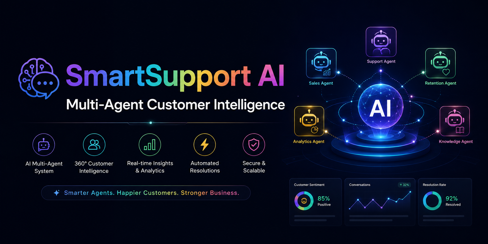
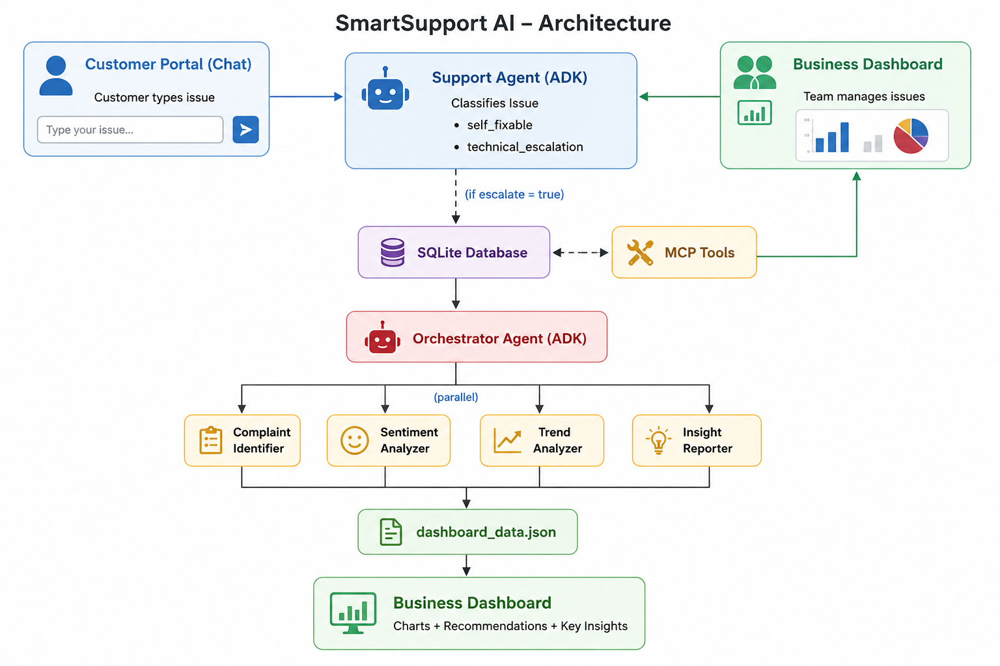

<div align="center">

# SmartSupport AI
### B2B Multi-Agent Customer Support & Business Intelligence Platform

[](https://python.org)
[](https://google.github.io/adk-docs/)
[](https://deepmind.google/gemini/)
[](https://fastapi.tiangolo.com)
[](https://github.com/jlowin/fastmcp)
[](https://sqlite.org)
[](https://developer.mozilla.org/en-US/docs/Web/HTML)
[](LICENSE)

**Kaggle 5-Day AI Agents Intensive — Capstone Project**
**Track: Agents for Business**

• [📹 Video](#video-demo) • [🏗️ Architecture](#architecture) • [⚙️ Setup](#setup)

</div>

---

## 🎯 Problem Statement

Modern SaaS companies receive hundreds or even thousands of customer support requests, reviews, and bug reports every day. As customer volume grows, manually reviewing every conversation becomes slow, inconsistent, and expensive. This makes it difficult for support and product teams to identify recurring issues, understand customer sentiment, prioritize engineering work, and respond quickly to emerging problems.

Businesses need an intelligent system that can automatically analyze customer conversations, detect recurring complaint patterns, monitor sentiment trends over time, escalate critical issues when necessary, and generate actionable business recommendations. Without these capabilities, valuable customer insights are often missed, leading to slower decision-making, reduced customer satisfaction, and increased operational costs.

SmartSupport AI solves this challenge by using a multi-agent architecture to automate customer support, continuously analyze customer feedback in real time, and transform customer conversations into actionable business intelligence through an interactive analytics dashboard.

---

## 💡 Solution

**SmartSupport AI** is a production-ready **B2B Multi-Agent Customer Support & Customer Intelligence Platform** built with **Google ADK, MCP, and Gemini**.

The platform transforms customer conversations into actionable business insights by combining intelligent support automation with real-time analytics.

It enables businesses to:

- 🤖 Automatically classify customer issues and determine whether they can be resolved instantly or require technical escalation.
- 💬 Generate professional, empathetic support responses to improve customer experience.
- 📊 Detect recurring complaint patterns before they become major business problems.
- 😊 Analyze customer sentiment and monitor trends over time.
- 📈 Generate prioritized business recommendations that help product and support teams focus on the highest-impact issues.
- 📉 Visualize insights through an interactive dashboard with complaint trends, sentiment analytics, and business KPIs.

> Instead of manually reviewing hundreds of customer conversations, 
> SmartSupport AI enables six specialized AI agents to analyze issues in 
> seconds and provide clear, actionable insights for faster business 
> decisions.

---

## 🏗️ Architecture



---

## 🤖 Agents (Google ADK + Gemini 2.5 Flash)

| Agent | Role |
|---|---|
| **Support Agent** | Classifies complaints, drafts replies, decides escalation |
| **Orchestrator Agent** | Coordinates all analysis agents in pipeline |
| **Complaint Identifier** | Finds top repeated complaints, groups by category |
| **Sentiment Analyzer** | Scores each issue, tracks monthly sentiment trends |
| **Trend Analyzer** | Detects growing issues, flags worsening problems |
| **Insight Reporter** | Generates prioritized business recommendations |

---

## 🔧 MCP Tools (FastMCP Server)

| Tool | Purpose |
|---|---|
| `save_issue()` | Save customer issue to SQLite |
| `fetch_all_issues()` | Retrieve all issues |
| `fetch_active_issues()` | Get only Open/In Progress issues |
| `update_issue_status()` | Mark as Resolved/In Progress |
| `get_repeat_issues()` | Detect recurring complaints |
| `save_dashboard_data()` | Save analysis results for dashboard |

---

## ✨ Key Features

### 🧠 Smart Escalation Logic
self_fixable → Agent gives troubleshooting steps
Issue saved as "Pending Customer Action"
Orchestrator NOT triggered yet
technical_escalation → Agent escalates immediately
Issue saved as "Open"
Orchestrator triggered instantly
Business dashboard updated

### 📊 Business Intelligence Dashboard
- Real-time sentiment trend charts
- Top complaint categories bar chart
- Daily issue volume tracking
- AI-generated business recommendations
- Issue management with status updates
- Recurring issue alerts

### 💬 Customer Support Portal
- WhatsApp-style chat interface
- Instant AI replies
- Smart classification badges
- Escalation status indicators

---

## 🛠️ Tech Stack

| Category | Technology |
|---|---|
| AI Framework | Google ADK 1.3.0 |
| LLM | Gemini 2.5 Flash |
| Backend | FastAPI + Uvicorn |
| MCP Server | FastMCP |
| Database | SQLite3 |
| Frontend | HTML5 + CSS3 + JavaScript |
| Charts | Chart.js |
| Package Manager | pip |
| Language | Python 3.13 |

---

## 📁 Project Structure

```
customer_insight_agent/
├── .env                          # API keys (not in git)
├── requirements.txt              # Dependencies
├── api/
│   └── server.py                 # FastAPI backend
├── agents/
│   ├── complaint_identifier.py   # Finds repeated complaints
│   ├── sentiment_analyzer.py     # Analyzes sentiment trends
│   ├── trend_analyzer.py         # Monthly trend analysis
│   ├── insight_reporter.py       # Business recommendations
│   └── support_agent.py          # Smart reply + escalation
├── orchestrator/
│   └── orchestrator_agent.py     # Pipeline coordinator
├── mcp_tools/
│   └── data_tool.py              # MCP Server (6 tools)
├── frontend/
│   ├── dashboard.html            # Business dashboard
│   └── customer.html             # Customer chat portal
├── data/
│   └── issues.db                 # SQLite database
└── README.md
```
---

## ⚙️ Setup

### Prerequisites
- Python 3.13+
- Gemini API Key from [Google AI Studio](https://aistudio.google.com)

### Installation

```bash
# 1. Clone the repository
git clone https://github.com/abubakar1yousafzai/SmartSupport-AI
cd SmartSupport-AI

# 2. Install dependencies
pip install -r requirements.txt

# 3. Create .env file
echo "GEMINI_API_KEY=your_key_here" > .env

# 4. Start the server
uvicorn api.server:app --host 0.0.0.0 --port 8000 --reload

# 5. Open in browser
# Business Dashboard: http://localhost:8000
# Customer Portal:    http://localhost:8000/customer
# API Docs:           http://localhost:8000/docs
```

---

## 📹 Video Demo

[](https://youtu.be/ayeYnI85OQI)

---

## 🎓 Course Concepts Demonstrated

| Concept | Implementation |
|---|---|
| Multi-Agent System (ADK) | 6 specialized agents with orchestrator |
| MCP Server | FastMCP with 9 tools |
| Security | API keys in .env, CORS, input validation |
| Deployability | FastAPI + Uvicorn, one command setup |
| Antigravity IDE | Used for development and agent building |

---

## 📄 License

MIT License — feel free to use and modify.

---

<div align="center">
Built with ❤️ using Google ADK + Gemini 2.5 Flash
<br>
Kaggle 5-Day AI Agents Intensive Capstone 2026
</div>